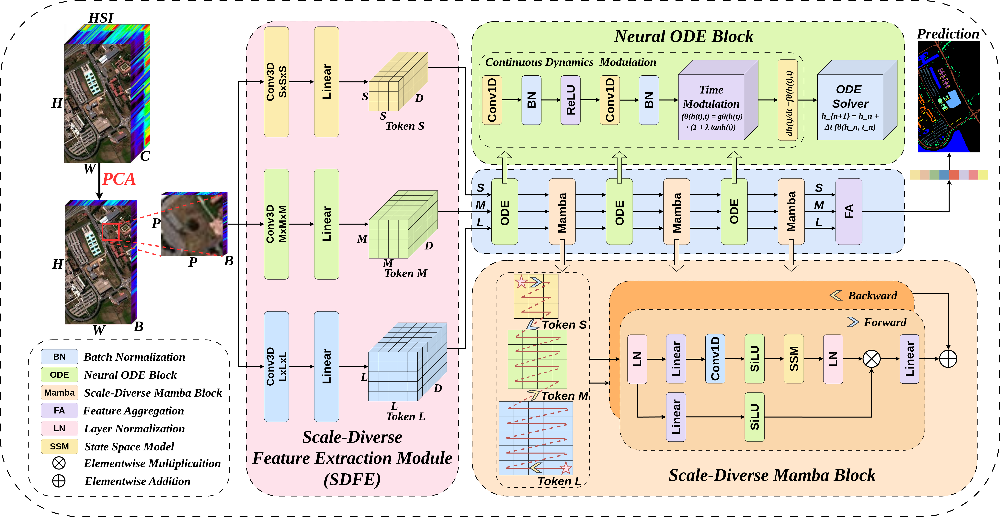

# HyperMODE: A Continuous-Depth Spectral-Spatial Modeling Framework with Mamba and Neural Ordinary Differential Equations for Hyperspectral Image Classification

**HyperMODE: A Continuous-Depth Spectral-Spatial Modeling Framework with Mamba and Neural Ordinary Differential Equations for Hyperspectral Image Classification**, published at *IEEE Journal of Selected Topics in Applied Earth Observations and Remote Sensing* (JSTARS), 2026. doi: [10.1109/JSTARS.2026.3705708](https://doi.org/10.1109/JSTARS.2026.3705708).



---
## HyperMODE (Mean ± Std)

| Dataset | Overall Acc. (%) | Average Acc. (%) | Kappa (%) |
|:--|:--:|:--:|:--:|
| Pavia University (1%) | **97.78 ± 0.20** | 95.83 ± 0.38 | 97.05 ± 0.26 |
| WHU-Hi-HanChuan (1%) | **97.71 ± 0.11** | 94.49 ± 0.45 | 97.32 ± 0.13 |
| WHU-Hi-LongKou (1%) | **99.55 ± 0.05** | 98.43 ± 0.26 | 99.41 ± 0.07 |
| Houston 2013 (10%) | **99.51 ± 0.04** | 99.56 ± 0.05 | 99.47 ± 0.05 |

## Experimental Settings

### Hyperparameters (Unified Across Datasets)

| Parameter | Value | Parameter | Value |
|-----------|-------|-----------|-------|
| Batch size | 64 | Patch size | 15 × 15 |
| PCA components | 30 | 3D Conv branch S kernel | (5, 5, 5) |
| 3D Conv branch M kernel | (7, 7, 7) | 3D Conv branch L kernel | (9, 9, 9) |
| Training epochs | 100 | Learning rate | 0.001 |
| Optimizer | Adam | | |

## Environment Setup

This project uses the **hypermode** environment configuration.

### Requirements

- Python 3.10
- CUDA 12.8 (for GPU acceleration)
- Linux (recommended for Triton support)

### Installation

1. Clone the repository:
```bash
git clone https://github.com/JaylenTang/HyperMODE.git
cd HyperMODE
```

2. Activate the conda environment:
```bash
conda activate hypermode
```

   Or if using the full path:
```bash
source /home/yubai03/anaconda3/envs/hypermode/bin/activate
```

3. Install dependencies (if not already installed in the environment):
```bash
pip install -r requirements.txt
```

### Key Dependencies

- **PyTorch** (2.8.0+cu128): Deep learning framework with CUDA 12.8 support
- **mamba_ssm** (>=2.0.0): Mamba state space model implementation
- **torchdiffeq** (>=0.2.0): Neural ODE solver
- **einops** (>=0.6.0): Tensor operations
- **scikit-learn** (>=1.0.0): Machine learning utilities

##  Acknowledgement

This repository builds upon the following works:


- [**HSI-MFormer: Integrating Mamba and Transformer Experts for Hyperspectral Image Classification**](https://doi.org/10.1109/TGRS.2025.3564167) [[Code]](https://github.com/tubingnuist/HSI-MFormer)
- [**Neural Ordinary Differential Equations for Hyperspectral Image Classification**](https://ieeexplore.ieee.org/document/8892510)
- [**Dual ODE: Spatial-Spectral Neural Ordinary Differential Equations for Hyperspectral Image Super-Resolution**](https://doi.org/10.1109/TGRS.2023.3346526)
